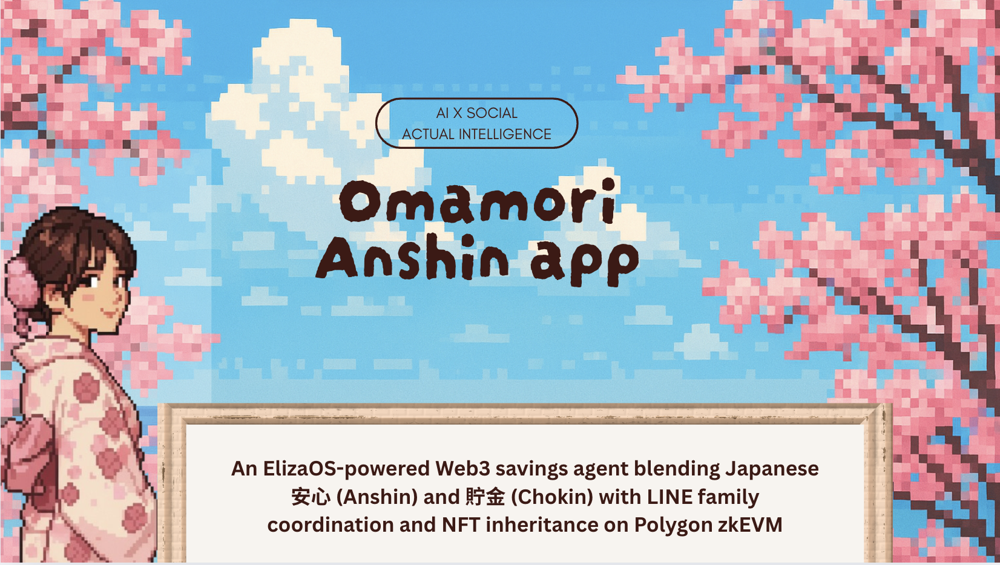

# 🌸 OMAMORI



**Cultural Preservation DeFi Platform with ElizaOS Integration**

OMAMORI combines Japanese cultural values with Web3 savings through AI-driven behavior, real-time blockchain transactions, and LINE Bot integration. A complete DeFi platform featuring family inheritance planning and personalized AI agent conversations.

## Features

- **Next.js Frontend**: Three-screen interface (Discovery, Garden, Hall) with minimalist design
- **ElizaOS Integration**: AI agent with cultural wisdom and personalized financial advice
- **LINE Bot**: Real-time messaging with QR code connection and family coordination
- **Blockchain Integration**: MetaMask transactions, smart contract interactions
- **Family Inheritance**: Multi-generational savings with on-chain heir designation
- **Cultural Values**: Japanese philosophy integrated into financial planning

## Tech Stack

### Frontend
- Next.js 15 + React 19 + TypeScript
- Tailwind CSS with minimalist black/white/gray design
- Framer Motion animations
- MetaMask Web3 integration

### Backend & AI
- ElizaOS v2.1.0 with plugin architecture
- LINE Bot SDK for real-time messaging
- Blockchain service with ethers.js
- Smart contracts (Hardhat + OpenZeppelin)

### Blockchain
- Polygon zkEVM Cardona testnet
- Japan Smart Chain (JSC) support
- EIP-712 signature verification
- ERC-721 NFT evolution system

## System Architecture

```
┌─────────────────┐    ┌─────────────────┐    ┌─────────────────┐
│   Frontend      │    │   LINE Bot      │    │   ElizaOS       │
│   (Next.js)     │◄──►│   Service       │◄──►│   Agent         │
│                 │    │                 │    │                 │
│ • Discovery     │    │ • QR Generation │    │ • Cultural AI   │
│ • Garden        │    │ • Messaging     │    │ • Plugins       │
│ • Hall          │    │ • Family Coord  │    │ • Wisdom        │
└─────────────────┘    └─────────────────┘    └─────────────────┘
         │                       │                       │
         └───────────────────────┼───────────────────────┘
                                 │
         ┌─────────────────────────────────────────────────────┐
         │              Blockchain Layer                       │
         │                                                     │
         │ ┌─────────────┐  ┌─────────────┐  ┌─────────────┐  │
         │ │   MetaMask  │  │ Smart       │  │ Inheritance │  │
         │ │ Integration │  │ Contracts   │  │ System      │  │
         │ └─────────────┘  └─────────────┘  └─────────────┘  │
         └─────────────────────────────────────────────────────┘
```

## Quick Start

```bash
# 1. Install dependencies
npm install

# 2. Configure environment
cp .env.example .env.local
# Edit .env.local with LINE Bot credentials

# 3. Start services
npm run dev                    # Frontend → http://localhost:3001
PORT=3002 node services/line-bot.js  # LINE Bot → http://localhost:3002

# 4. Test the system
curl http://localhost:3001/api/line/qr  # Test API
curl http://localhost:3002/health       # Test LINE Bot
```

## Usage

1. **Connect Wallet**: Use MetaMask to connect your Web3 wallet
2. **LINE Integration**: Click LINE button to generate QR code and connect
3. **Choose Path**: Select Individual savings or Family group mode
4. **Start Saving**: Make deposits and watch your omamori collection grow
5. **Family Planning**: Set inheritance beneficiaries via smart contracts

## Core Components

### Frontend Screens
- **Discovery**: Welcome screen with ElizaOS character dialog
- **Garden**: Savings interface with pet feeding mechanics
- **Hall**: Omamori collection display with achievement tracking

### LINE Bot Features
- QR code generation for instant connection
- Real-time family transaction notifications
- Cultural wisdom delivery via scheduled messages
- Japanese command support for family coordination

### Smart Contracts
- **OmamoriVault**: Main savings contract with EIP-712 signatures
- **Inheritance System**: On-chain heir designation and asset transfer
- **NFT Evolution**: Omamori collection that grows with savings progress

## Development

```bash
# Frontend development
npm run dev
npm run build
npm run preview

# Smart contracts
npm run compile
npm run test
npm run deploy

# LINE Bot services
node services/line-bot.js
node services/line-bot-demo.js
```

## Cultural Integration

OMAMORI embodies core Japanese values:
- **もったいない (Mottainai)**: Waste prevention through mindful saving
- **おもてなし (Omotenashi)**: Respectful user experience design
- **協働 (Kyōdō)**: Community cooperation in family savings
- **伝統 (Dentō)**: Cultural tradition preservation through technology

## License

MIT License - See LICENSE file for details.

---

*Bridging traditional Japanese wisdom with modern Web3 technology*